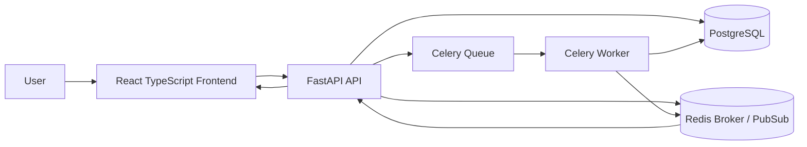

# Async Document Processing Workflow System

Full-stack internship submission for the assignment: **Build an Async Document Processing Workflow System**.

The attached problem statement was treated as the product/engineering requirement document. The implementation focuses on the mandatory async workflow: request handlers only create jobs, while Celery workers process documents in the background and publish progress through Redis Pub/Sub.

## What Is Included

- React + TypeScript frontend
- FastAPI backend
- PostgreSQL persistence
- Celery worker
- Redis broker and Redis Pub/Sub progress updates
- Upload screen
- Jobs dashboard with search, status filter, sorting, and progress bars
- Job detail/review screen
- Editable structured result JSON
- Finalize workflow
- Export finalized records as JSON or CSV
- Retry support for failed jobs
- Docker Compose setup
- Sample test files and sample exported output

## Architecture



## Processing Flow

1. User uploads one or more documents from the frontend.
2. FastAPI saves file metadata and creates a queued job in PostgreSQL.
3. FastAPI enqueues a Celery task and returns immediately.
4. Celery worker processes the document in background stages:
   - `job_started`
   - `document_parsing_started`
   - `document_parsing_completed`
   - `field_extraction_started`
   - `field_extraction_completed`
   - `job_completed` or `job_failed`
5. Worker stores extracted structured JSON in PostgreSQL.
6. Worker publishes progress events to Redis Pub/Sub.
7. Frontend listens to job progress using the backend SSE endpoint.
8. User reviews/edits the output, finalizes it, then exports JSON or CSV.

## API Surface

| Method | Endpoint | Purpose |
| --- | --- | --- |
| `POST` | `/api/documents` | Upload one or more documents and enqueue jobs |
| `GET` | `/api/jobs` | List jobs with search, status filter, and sorting |
| `GET` | `/api/jobs/{job_id}` | Get job details, events, and extracted result |
| `GET` | `/api/jobs/{job_id}/events` | Stream live progress events with SSE |
| `POST` | `/api/jobs/{job_id}/retry` | Retry a failed job |
| `PATCH` | `/api/jobs/{job_id}/review` | Save edited/reviewed structured output |
| `POST` | `/api/jobs/{job_id}/finalize` | Finalize reviewed output |
| `GET` | `/api/jobs/{job_id}/export?format=json` | Export finalized JSON |
| `GET` | `/api/jobs/{job_id}/export?format=csv` | Export finalized CSV |

## Run With Docker Compose

This is the easiest and recommended way to run the full submission because PostgreSQL, Redis, FastAPI, Celery, and React all start together.

Prerequisites:

- Docker Desktop
- Git

Steps:

```powershell
cd async_document_workflow_submission
docker compose up --build
```

Windows users can also double-click:

```text
scripts/run-docker.bat
```

Open:

- Frontend: `http://localhost:5173`
- Backend API docs: `http://localhost:8000/docs`
- Health check: `http://localhost:8000/health`

## Local Development Setup

Use this only if Docker Desktop is already running PostgreSQL and Redis, or if you started only those two services with Docker Compose.

Recommended local versions:

- Python 3.11 or 3.12
- Node.js 20 or newer

Python 3.9 can work, but Docker is smoother on Windows because it avoids native build-tool issues.

Run infrastructure:

```powershell
cd async_document_workflow_submission
docker compose up postgres redis
```

Backend:

```powershell
cd backend
python -m venv .venv
.venv\Scripts\activate
pip install -r requirements.txt
uvicorn app.main:app --reload --port 8000
```

Worker in a second terminal:

```powershell
cd backend
.venv\Scripts\activate
celery -A app.worker.celery_app worker --loglevel=info --pool=solo
```

Frontend in a third terminal:

```powershell
cd frontend
npm install
npm run dev
```

For Windows, these helper scripts do the same setup:

```text
scripts/run-backend.bat
scripts/run-worker-windows.bat
scripts/run-frontend.bat
scripts/run-tests.bat
```

Important: the backend and worker require PostgreSQL and Redis. For the smoothest demo, use `scripts/run-docker.bat`.

## Demo Steps For Video

Use this short flow for the required 3-5 minute demo video:

1. Show Docker Compose services running.
2. Open `http://localhost:5173`.
3. Upload `sample_files/invoice_alpha.txt` and `sample_files/contract_beta.txt`.
4. Show dashboard jobs entering queued/processing/completed states.
5. Open a job detail page and show progress timeline events.
6. Edit the extracted JSON in the review box.
7. Save review and finalize.
8. Export JSON and CSV.
9. Briefly open FastAPI docs to show backend API design.

## Assumptions

- Advanced OCR or AI extraction quality is not the evaluation target, so non-text files use mock parsed content.
- Text-like files such as `.txt`, `.md`, `.csv`, and `.json` are parsed directly.
- SSE is used to expose Redis Pub/Sub progress updates to the browser.
- Files are stored on local/container volume storage for this assignment.

## Tradeoffs

- File storage is local instead of S3 because the assignment focuses on async workflow architecture.
- Database migrations are not included; the app creates tables on startup for quick review.
- Authentication is not implemented, but the structure leaves room to add it later.
- The processor intentionally keeps business logic simple so the async workflow, progress tracking, retry behavior, and review/export flow remain easy to evaluate.

## Limitations

- Local uploads volume should be backed up or replaced by object storage for production.
- SSE stream is per selected job; a production dashboard could use one multiplexed stream.
- CSV export flattens top-level JSON fields for readability.

## AI Tool Note

AI assistance was used during development. Please review the code and be ready to explain the architecture, API flow, Celery worker behavior, Redis Pub/Sub usage, retry handling, and tradeoffs in your own words during the internship evaluation.
